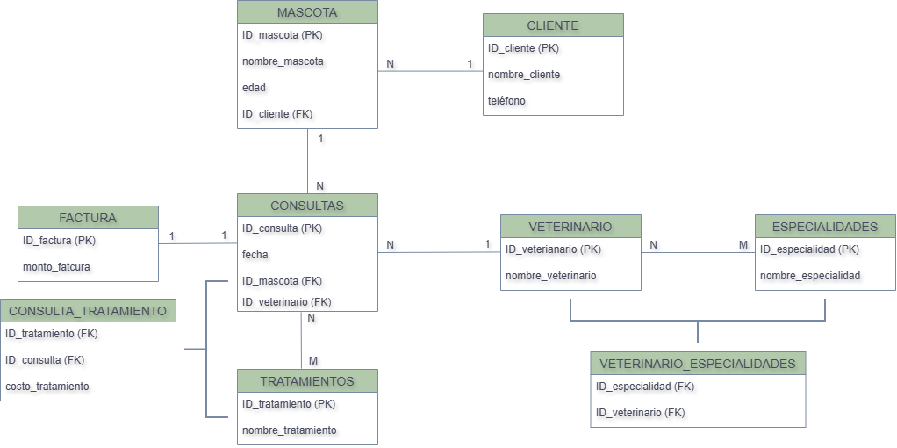

# KLT3 GESTOR DE BASES DE DATOS RELACIONALES

## Descripción de la práctica

Una veterinaria pequeña necesita organizar su información en una base de datos relacional. 

## Reglas del negocio:

La veterinaria atiende mascotas registradas por sus dueños (clientes). 

Un cliente puede tener varias mascotas, pero cada mascota pertenece a un único cliente. Cada 

mascota puede tener muchas consultas a lo largo del tiempo, y cada consulta es atendida por 

un único veterinario. En una misma consulta se pueden aplicar uno o varios tratamientos de 

un catálogo fijo (vacuna, desparasitación, cirugía menor, limpieza dental…), y un mismo 

tratamiento se aplica en muchas consultas distintas — por cada tratamiento aplicado se debe 

registrar también el costo cobrado ese día (puede variar de una consulta a otra, por eso no 

es un dato fijo del tratamiento). Cada veterinario tiene una o varias especialidades 

(cirugía, dermatología, nutrición…), y una misma especialidad la puede tener más de un 

veterinario. Al cerrar una consulta se genera una factura con el monto total a pagar.

## Entidades:

mascota, cliente, consulta, veterinario, tratamiento, especialidad, factura.

## Diagrama Entidad-Relacion

## Verificación de cumplimiento de la 3 FN: 

Se cumple con la atomicidad, todos los datos son atómicos por lo tanto se cumple con la 

primera forma normal 1 FN.

No existen dependencias parciales, Si una tabla tiene una llave primaria compuesta, todos 

los demás datos de la tabla deben depender de la combinación de toda la llave, no solo de 

una parte de ella, por lo tanto, se cumple con la segunda forma normal 2 FN.

No existen dependencias transitivas, los atributos que no forman parte de la llave primaria 

dependen completamente de la llave primaria de su respectiva tabla por lo tanto se cumple 

con la tercera forma normal 3 FN.
